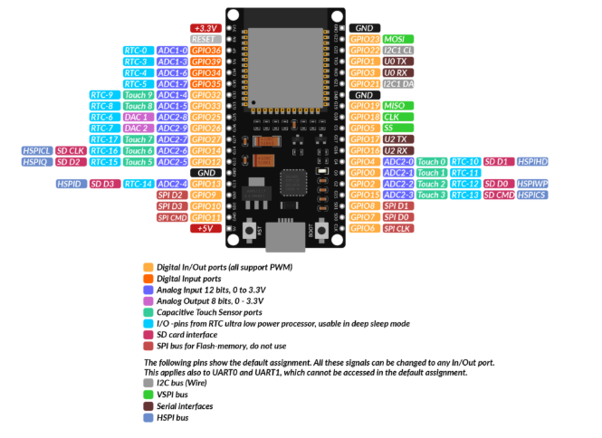

# Descrição do Projeto
NEste projeto consiste na criação de um circuito que exibe a temperatura e a humidade em um display, enquanto envia essas informações para um terminal Bluetooth. Os valores são lidos por um sensor de temperatura e de humidade. 
Se a temperatura não ultrapassar um determinado valor, um LED verde será aceso, caso contrário, um LED vermelho será acionado.
Além disso, há um sensor de toque que permite ligar e desligar o display. Quando ocorre uma interação com o sensor de toque, um LED é aceso e um buzzer emite um som por um determinado período de tempo.
Existem duas formas de ligar e desligar o circuito inteiro, utilizando as funcionalidades do ESP-32. A primeira é por meio de um botão que permite ativar ou desativar o circuito por meio dos touch pins presentes no microcontrolador. A segunda é por meio da funcionalidade Bluetooth que na inserção no serial ou no telemóvel do algarismo:
•	0 - desliga o Circuito
•	1 - liga o Circuito

# Elementos do Projeto

•	1 led azul
•	1 led vermelho
•	1 led verde
•	1 Esp-32 DEV KIT C V2
•	1 breadbord grande
•	2 breadbord pequenas
•	3resistências de 100 Ω
•	1 pionés
•	1 display lcd 2
•	1 buzzer
•	1 dht 11
•	TTP223B (sensor touck)
•	Fios (macho-macho)
•	Fios (macho-fêmea)
•	módulo de fonte de alimentação de breadbord 

# Imagem do Circuito montado

# ESP-32 do Circuito Caracteristicas
 É possível observar as caracteristicas do ESP32 através deste link: https://www.edu.xunta.gal/centros/ieslaxeiro/system/files/ESP-32%20Dev%20Kit%20C%20V2_EN.pdf

